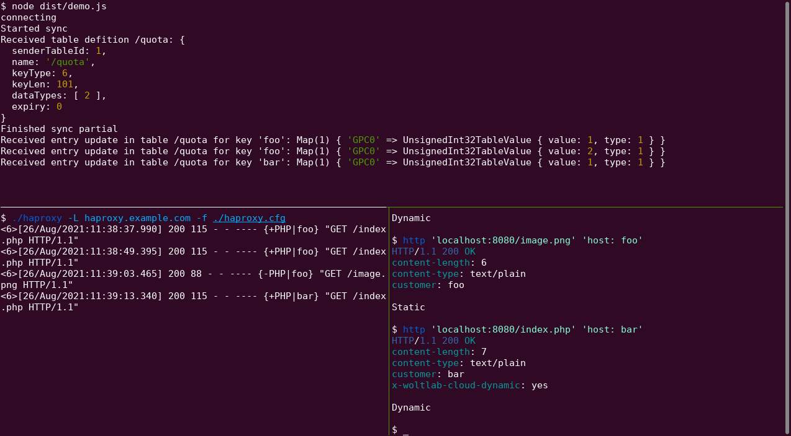

# HAProxy Peers Protocol for node.js

This repository implements HAProxy’s Peers Protocol in TypeScript for use in node.js.



## Usage

Have a look at [src/demo.ts](./src/demo.ts) for a simple usage example.

## Origins of this Library

This library was developed to perform accurate and efficient quota tracking of
dynamic requests in WoltLab's software-as-a-service offering [*WoltLab Cloud*](https://www.woltlab.com/cloud/).

The [demo configuration](./haproxy.cfg) still reflects these origins within the
`x-woltlab-cloud-dynamic` header that is used identically within our production
configuration.

We open-sourced the library as part of our talk “Using HAProxy Peers for
Real-time Quota Tracking” at [HAProxyConf 2021 Virtual](https://www.haproxyconf.com/).
The talk’s slides are available within [slides.pdf](./slides.pdf).

## License

```
Copyright (C) 2020 WoltLab GmbH

This program is free software: you can redistribute it and/or modify
it under the terms of the GNU Lesser General Public License as published by
the Free Software Foundation, either version 3 of the License, or
(at your option) any later version.

This program is distributed in the hope that it will be useful,
but WITHOUT ANY WARRANTY; without even the implied warranty of
MERCHANTABILITY or FITNESS FOR A PARTICULAR PURPOSE.  See the
GNU Lesser General Public License for more details.

You should have received a copy of the GNU Lesser General Public License
along with this program.  If not, see <https://www.gnu.org/licenses/>.

SPDX-License-Identifier: LGPL-3.0-or-later
```
